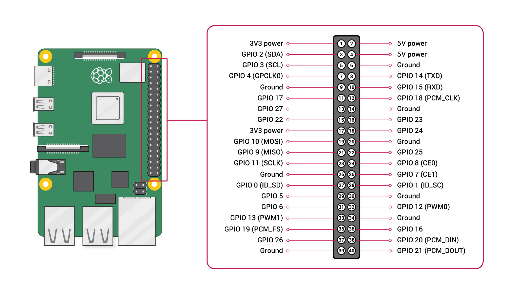

# Automatic garden watering system <!-- omit in toc -->

## Table of contents <!-- omit in toc -->

- [General](#general)
- [Running](#running)
  - [Production](#production)
  - [Testing without RPI](#testing-without-rpi)
- [`.env`](#env)
- [Timeouts](#timeouts)
- [Debugging](#debugging)

## General

This project consists of a Raspberry Pi 4 running Ubuntu server (x64) that is connected to various floaters inside 2 water tanks and to various relays that control solenoid valves. Here's some specific info:
- Valves 1 - 4, 8 and 9 are for watering the garden
- Rain is a property set to define that it will or is currently raining for certain conditions to occur
- Tap water can be manually activated or deactivated, equals to Valve 5
- Pump is to manually activate or deactivate it, equals to Valve 6
- Letting water fall back down from tank 2 to 1 is done with Valve 7
- There are 5 floaters, three in the first tank and two in the second

GPIO pins are always written in [BCM pin numbers](https://www.raspberrypi.com/documentation/computers/raspberry-pi.html#gpio-and-the-40-pin-header).



GPIO pins also have a default state when booting the PI, which affects the temporary state of a relay switch until this project is running, which overwrites the default states to the desired ones. [Here's a good read about it](https://roboticsbackend.com/raspberry-pi-gpios-default-state/), as well as the [technical file](https://www.raspberrypi.org/app/uploads/2012/02/BCM2835-ARM-Peripherals.pdf#page=102). In short:
> HIGH for GPIOs up to 8, and LOW for GPIOs starting from 9.

On top of this, certain GPIO pins have special functions, and its best to not use those. So, after chatting with an AI, here are the supposed ideal GPIO pins:

| Function            | GPIO Pin | Notes               | Physical Pin |
| ------------------- | -------- | ------------------- | ------------ |
| Floater 1           | GPIO 4   | Input with pull-up  | Pin 7        |
| Floater 2           | GPIO 17  | Input with pull-up  | Pin 11       |
| Floater 3           | GPIO 27  | Input with pull-up  | Pin 13       |
| Floater 4           | GPIO 22  | Input with pull-up  | Pin 15       |
| Floater 5           | GPIO 5   | Input with pull-up  | Pin 29       |
| Valve 1             | GPIO 26  | Output, default LOW | Pin 37       |
| Valve 2             | GPIO 18  | Output, default LOW | Pin 12       |
| Valve 3             | GPIO 23  | Output, default LOW | Pin 16       |
| Valve 4             | GPIO 24  | Output, default LOW | Pin 18       |
| Tap water           | GPIO 6   | Output, default LOW | Pin 31       |
| Pump water up       | GPIO 13  | Output, default LOW | Pin 33       |
| Transfer water down | GPIO 19  | Output, default LOW | Pin 35       |
| Valve 8             | GPIO 25  | Output, default LOW | Pin 22       |
| Valve 9             | GPIO 20  | Output, default LOW | Pin 38       |

## Running

### Production

Make sure the `.env` file is set to `prod`.

**You need to run this with `root`.** Else GPIO access won't be granted. I've configured [`pm2`](https://pm2.keymetrics.io/) to start the process on startup with sudo:

```shell
sudo -s
pm2 startup
pm2 start main.js --name "Watering System" --watch
pm2 save
```

### Testing without RPI

Copy the `.env` file example below as is, execute `npm i` and then `npm run start`. Requires `sudo apt-get install build-essential`.

## `.env`

Here's an example for the `.env` file:

```env
WS_ENV=test
WS_PORT=3000
WS_MANUAL_TIMEOUT=28800000
WS_VALVE1_TIMEOUT=120000
WS_VALVE2_TIMEOUT=120000
WS_VALVE3_TIMEOUT=120000
WS_VALVE4_TIMEOUT=120000
WS_TAPWATER_TIMEOUT=172800000
WS_PUMP_TIMEOUT=1200000
WS_TRANSFER_TIMEOUT=1200000
WS_VALVE8_TIMEOUT=120000
WS_VALVE9_TIMEOUT=120000
```

## Timeouts

| Designation | Time     | `ms`      |
| ----------- | -------- | --------- |
| Manual mode | 8 hours  | 28800000  |
| Valve 1     | 2 mins   | 120000    |
| Valve 2     | 2 mins   | 120000    |
| Valve 3     | 2 mins   | 120000    |
| Valve 4     | 2 mins   | 120000    |
| Tap water   | 48 hours | 172800000 |
| Pump        | 20 mins  | 1200000   |
| Transfer    | 20 mins  | 1200000   |
| Valve 8     | 2 mins   | 120000    |
| Valve 9     | 2 mins   | 120000    |

## Debugging

The PI sends a 3.3V current from the GPIO pins and is capable of measuring if a circuit is closed or not when the other end connects to Ground. The voltage is so minimal that you do not feel it on your hands, so it's safe to work with it. You should therefore be able to check the various connections of the floaters circuit for 3.3V (not the circuit after the relays, which is connected to 24V), and whenever a voltage doesn't make sense, you'd be closer to the source of the problem.
